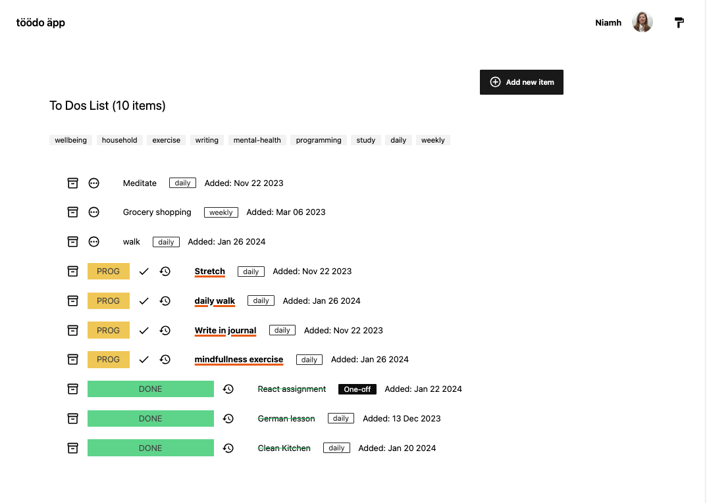
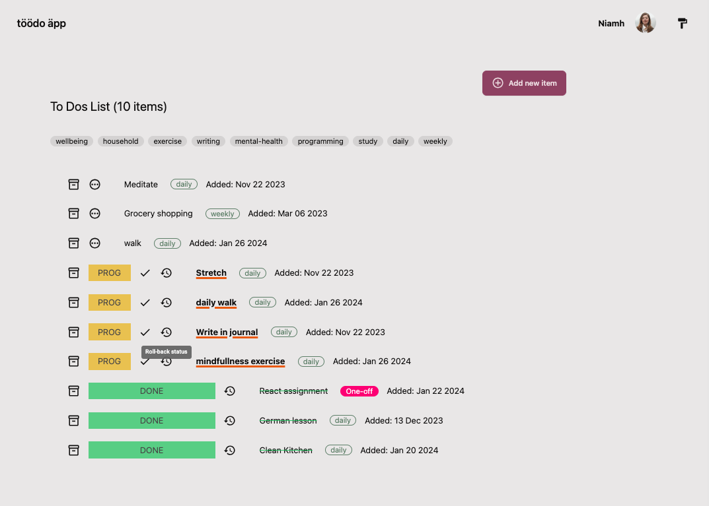

# töödo äpp

A to do app built with React.js and Vite and styled with [Tailwind](https://tailwindcss.com/) and [Daisy](https://daisyui.com/). Also makes use of [Material Icons](https://mui.com/material-ui/material-icons/).

The name _töödo äpp_ is a joke that Estonians 🇪🇪 will understand. _Töö_ means "work" in Estonian.

Niiv Dev OÜ is a fictional company. This is a practice React project coded up for an assignment as part of the CodeOp fullstack bootcamp.

## How to run

In one terminal

```
npm i
npx tailwindcss -i ./src/index.css -o .src/output.css --watch
```

In a second terminal

```
npm run dev
```

## Screens

### Welcome screen

Login takes the user to the todos (main) screen. Logout from the app takes the user back to the welcome screen.


### Todos screen (hub of app)

Todos can be filted by tag (frequency – daily, weekly, monthly – and custom user-provided tags). Todos are conditionally styled depending on status ("new", "in progress",, "completed").



Add new item form accepts tags separated by spaces.


### Archive

Todos can be sent to an archive, removing them from the main todo screen.


### Statistics

Statistics are provided.

1. Stats on active (ie. not in archive) daily todos (todos with frequency of "daily").
2. Stats on all active (ie. not in archive) todos.
3. Historic stats on how many todos were created, completed, archived, restored from the archive, and permanetly deleted.


## Features

### Actions

Todos can be:

1. Archived (sent to archive screen).
2. Marked as "in progress", or "completed".
3. Todos that are in-progress or completed can be rolled-back to the earlier state.



### Edit profile form

An edit profile form allows the user to update their name and avatar.


### Warning modal

A warning modal warns the user prior to destructive actions occuring.


### Deleting permanently

From the archive to dos can be deleted permanently or restored to the main todo screen. There is also functionality to restore all todos in the archive to the todos view or delete all.


### Theme changer

Theme changer is contained in a drawer


